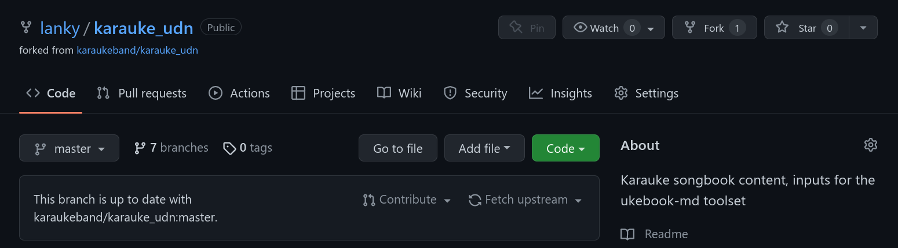

# Editing in github

The basic steps to follow to edit/update this stuff online

## Login to github

You'll need a github.com account for this

## create your own fork of the repo

There's a `Fork` button in the top-right of the main repo page,
create a new fork (aka copy) of the repo one under your account.

## make the changes you want in your copy

The repo has several subdirectories to keep things a little organised.
Songs that are in the current live book are in the `current` dir, so
let's edit one of those

Just click on the `current` folder/directory and you should see something
like this:

You should see a list of files, plus some other history info (at the top) to
show how/when this was last changed

To edit a file, click on it, and then the pencil icon on the right

When you have made the changes you wanted to, preview them using the 
`preview changes` button:

This will show you the parts you changed. If you are happy with them, fill in the
**commit_changes** box (See the image for an example)

When committing, unless you know what you're doing, leave the "commit directly" 
radio button selected.

