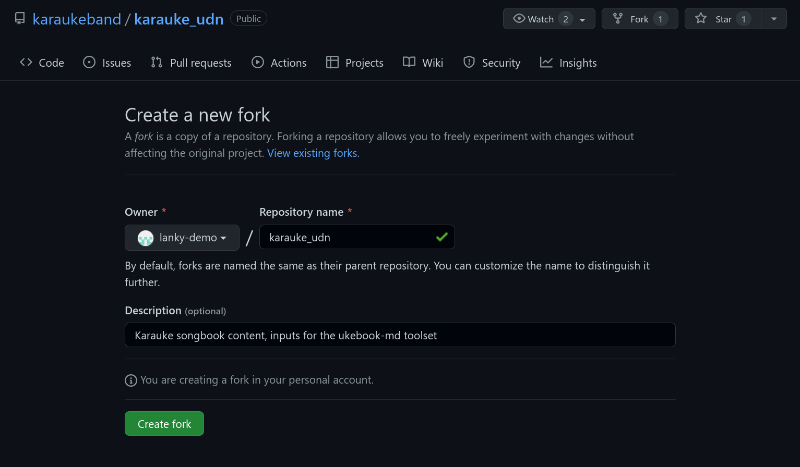
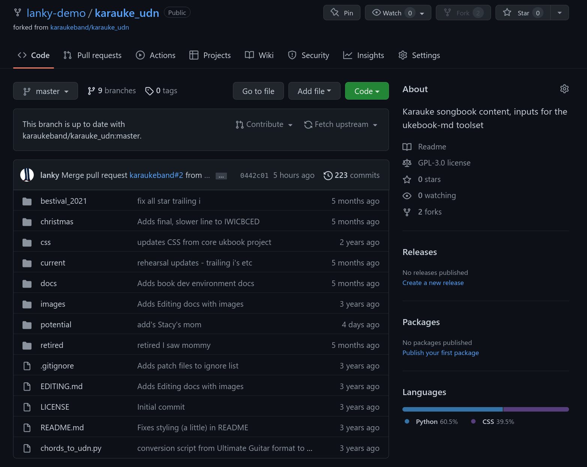
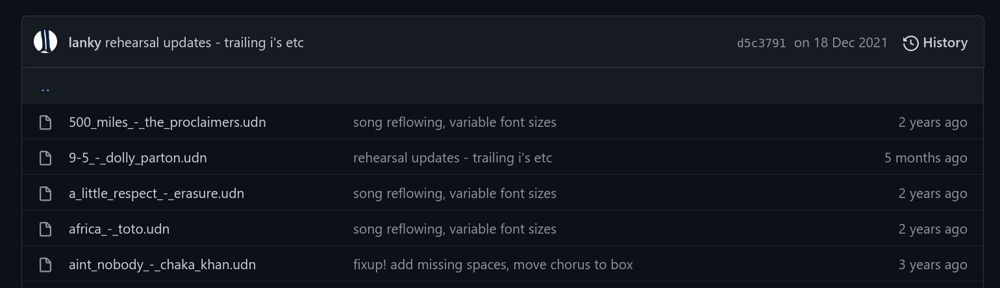
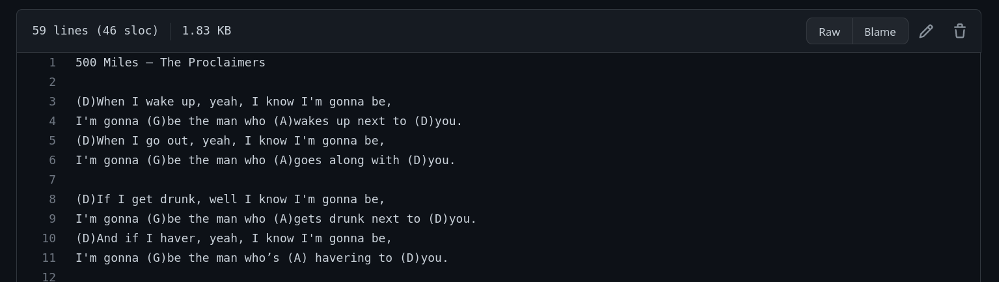
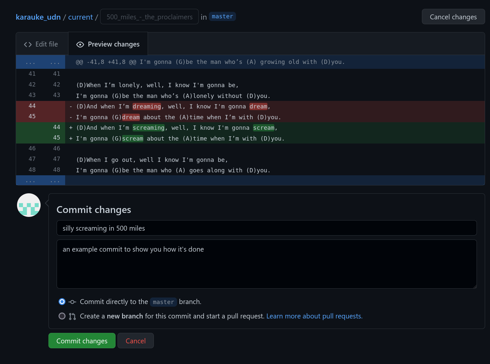
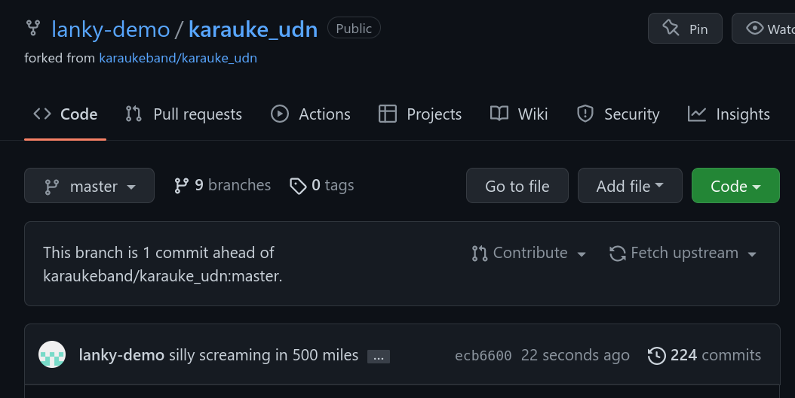
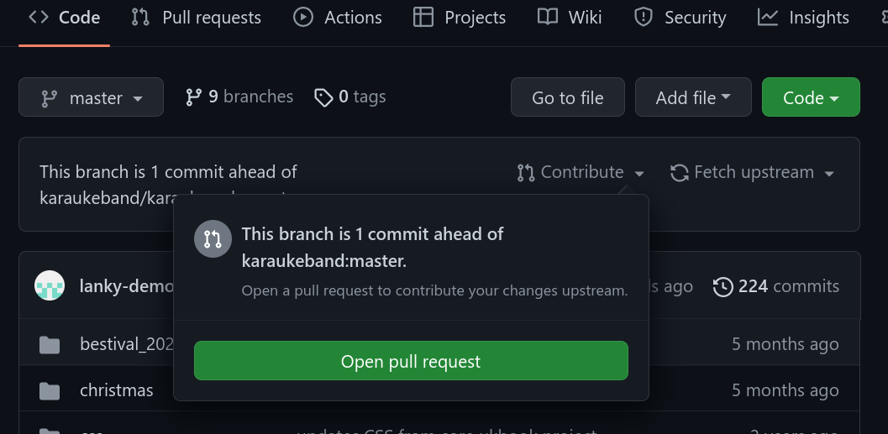
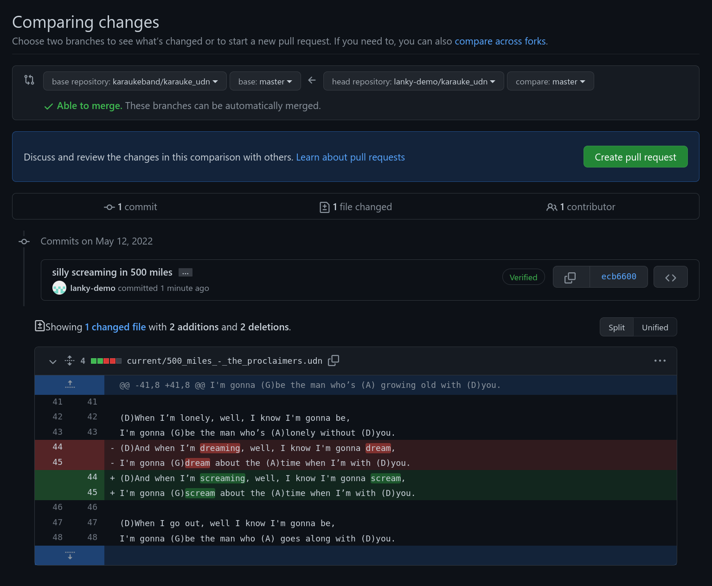
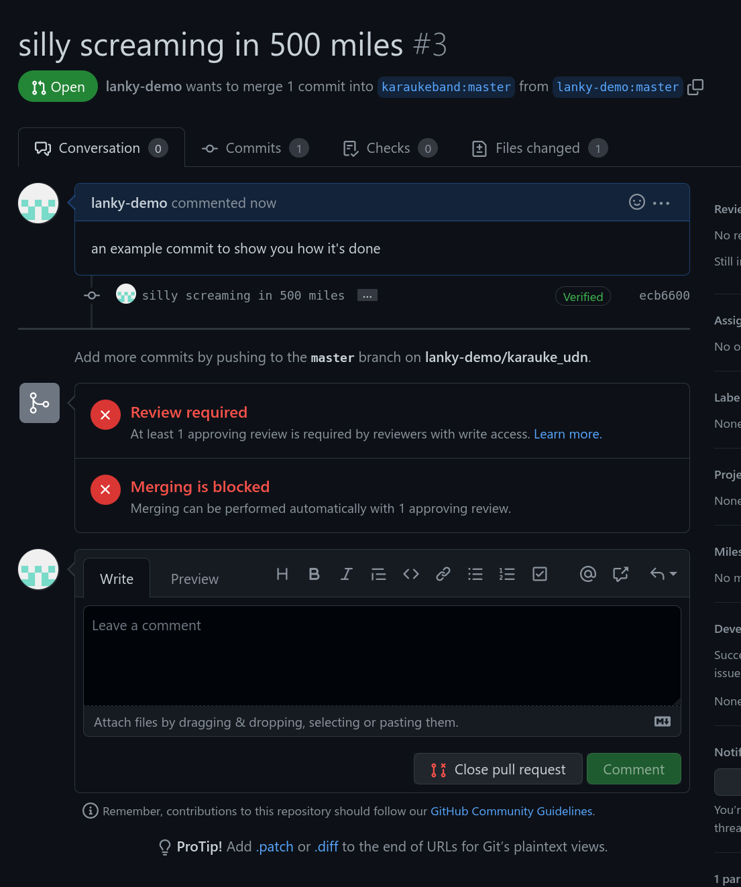

# Editing in github

The basic steps to follow to edit/update this stuff online

## Login to github

You'll need a github.com account for this

## create your own fork of the repo

There's a `Fork` button in the top-right of the main repo page,
create a new fork (aka copy) of the repo one under your account.

Once completed, you'll be switched to your copy("fork") of the repo

## make the changes you want in your copy

The repo has several subdirectories to keep things a little organised.
Songs that are in the current live book are in the `current` dir, so
let's edit one of those

Just click on the `current` folder/directory and you should see something
like this:

You should see a list of files, plus some other history info (at the top) to
show how/when this was last changed

To edit a file, click on it, and then the pencil icon on the right

## Preview the changes and commit them

When you have made the changes you wanted to, preview them using the 
`preview changes` button.

This will show you the parts you changed. If you are happy with them, fill in
the **commit_changes** box (See the image for an example)

When committing, unless you know what you're doing, leave the "commit directly"
radio button selected.

Commiting records your changes and gives them a description/name so we can see
what was changed, when and by whom.

When you press the `commit changes` button, github will save your changes and
take you back to the file content.

## Get them into the main repository

once you have made all the edits you wish to, to get them into the main book
repo you need to ask to have them imported.

You do this by creating a *Pull Request*

Go back to the top of your repo (click on its name). Github will know you have
made changes and should ask you if you would like to create a pull request.

You do this by clicking on the `Contribute` button

which should show you this:

Click on the `Open Pull Request` button

Once you've created it, this sits and waits for an admin to approve/merge it.

<!-- vim: set tw=80 nofen: -->
