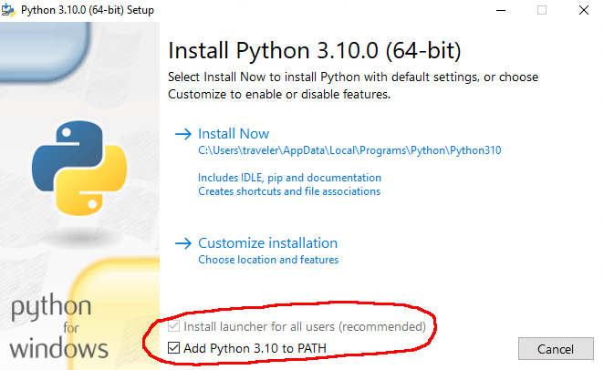
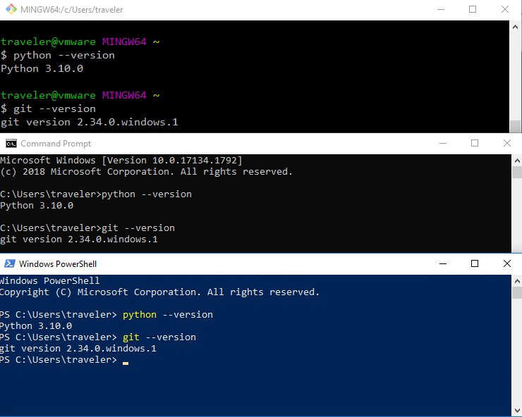
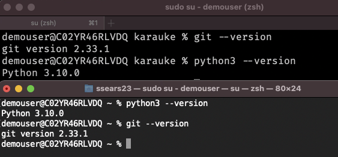

 <!-- markdownlint-disable MD013-->
 <!-- vim: set tw=100 : -->
# How to build a songbook from this repository

You'll need to immerse yourself in geekiness for this at present as there is no pretty clicky way to
achieve it, and no fancy-pants web interface for it, but it is pretty easy, actually.

## System Requirements

You'll need certain software on your computer to make this work - how you get it will depend on
your OS.

### 1. Python

You can install this from here: [Python Downloads](https://www.python.org/downloads/)
At the time of writing this was version 3.10. Just download this or any later version and run the
installer.

n.b. for the windows installation, it's important to check the **Add Python 3.10 to PATH** box:



Mac users will probably use the "universal installer" package

### 2. Git

Git is our means of managing songbook content and changes to songbook content on
[github](https://github.com). You can get this from the [git downloads
page](https://git-scm.com/downloads)

A step-by-step guide to installing this on windows is here [Installing git on Windows](docs/git-on-windows.md)

For Mac users, install [homebrew](https://brew.sh/) if you don't already have it and then
    
    brew install git

in a terminal/iterm2 window should do the trick.

### 3. (Optional) A decent terminal emulator

This will make things easier to use, IMO, but the default built-in MacOS Terminal and the Windows
Command Prompt (or powershell) will also work just fine.

On Windows git also comes with a shell called "git bash" - this is probably the best choice here.


### 4. (Optional) A decent text (or programmer's) editor

If you want to make any changes to the songsheets, you will need an editor that makes this easier.
There are loads. Here are some...

TextEdit (mac)  - I think this is preinstalled
Notepad++ (windows) - although the default "Notepad" can also work, it is ugly and fiddly.
Atom (cross-platform, from github)

There's a decent list of them here, too: https://www.techradar.com/uk/best/best-text-editors

## Checking it all worked

On windows, open a terminal (any of 'git bash', 'command prompt' or 'windows powershell' will do),
and type the following

```
python --version

git --version
```

And it should look like these:



On a Mac, open either iterm or terminal and do the same thing, here's the Mac version:




# Setting up the build environment

Now we'll take a copy of this locally and treat it with wanton abandon, or something.


## Make local copies of the songbook and tools repos

For all this I am going to presume you are creating a new folder/directory called 'karauke' in your
user's documents area, which would be
- `/Users/yourname/Documents` on a mac
- `C:\Users\yourname\Documents` on windows.

If you put it somwhere else, you'll need to adjust your location appropriately

### clone the songbook repository

    git clone https://github.com/karaukeband/karauke_udn

which should result in

    Cloning into 'karauke_udn'...
    remote: Enumerating objects: 809, done.
    remote: Counting objects: 100% (169/169), done.
    remote: Compressing objects: 100% (96/96), done.
    remote: Total 809 (delta 88), reused 144 (delta 73), pack-reused 640
    Receiving objects: 100% (809/809), 2.96 MiB | 2.85 MiB/s, done.
    Resolving deltas: 100% (463/463), done.

### Clone the book creation tools

    git clone https://github.com/lanky/ukebook-md

which should do this:

    Cloning into 'ukebook-md'...
    remote: Enumerating objects: 1374, done.
    remote: Counting objects: 100% (206/206), done.
    remote: Compressing objects: 100% (119/119), done.
    remote: Total 1374 (delta 115), reused 165 (delta 86), pack-reused 1168
    Receiving objects: 100% (1374/1374), 388.24 KiB | 1.49 MiB/s, done.
    Resolving deltas: 100% (747/747), done.

## Set up the development environment for generating books

make sure you're in the `ukebook-md` directory

    cd ukebook-md

install the python dependencies for the songbook maker

    pip install --user -r requirements.txt

You should see a lot of lines similar to this:

    Collecting beautifulsoup4
      Downloading beautifulsoup4-4.10.0-py3-none-any.whl (97 kB)
    Collecting bs4
      Downloading bs4-0.0.1.tar.gz (1.1 kB)
    Collecting Jinja2
      Downloading Jinja2-3.0.3-py3-none-any.whl (133 kB)
    Collecting lxml
      Downloading lxml-4.6.4-cp310-cp310-win_amd64.whl (3.5 MB)
    Collecting Markdown
      Downloading Markdown-3.3.4-py3-none-any.whl (97 kB)
    Collecting MarkupSafe
      Downloading MarkupSafe-2.0.1-cp310-cp310-win_amd64.whl (15 kB)
    Collecting progress
      Downloading progress-1.6.tar.gz (7.8 kB)
    Collecting PyYAML
      Downloading PyYAML-6.0-cp310-cp310-win_amd64.whl (151 kB)
    Collecting soupsieve
      Downloading soupsieve-2.3.1-py3-none-any.whl (37 kB)
    Collecting Weasyprint
      Downloading weasyprint-53.4-py3-none-any.whl (242 kB)

Once this has finished, check what was installed using

    pip list --user

You should see a list of packages like this:

    Package        Version
    -------------- -------
    beautifulsoup4 4.10.0
    Brotli         1.0.9
    bs4            0.0.1
    cffi           1.15.0
    cssselect2     0.4.1
    fonttools      4.28.1
    html5lib       1.1
    Jinja2         3.0.3
    lxml           4.6.4
    Markdown       3.3.4
    MarkupSafe     2.0.1
    Pillow         8.4.0
    pip            21.3.1
    progress       1.6
    pycparser      2.21
    pydyf          0.1.2
    pyphen         0.11.0
    PyYAML         6.0
    six            1.16.0
    soupsieve      2.3.1
    tinycss2       1.1.0
    ukedown        1.0.0
    weasyprint     53.4
    webencodings   0.5.1
    zopfli         0.1.9

# Test if the tools actually run

The main tool for building books from ukedown files is `genbook.py`. It has a lot of options. To see them:

    ./genbook.py --help

and

    ./makepdf.py --help

