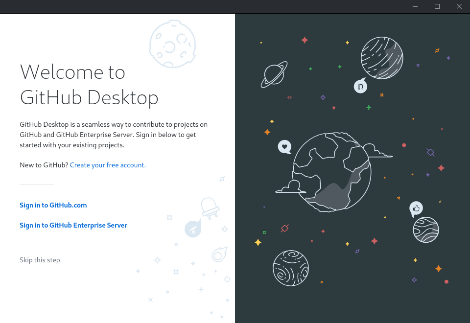
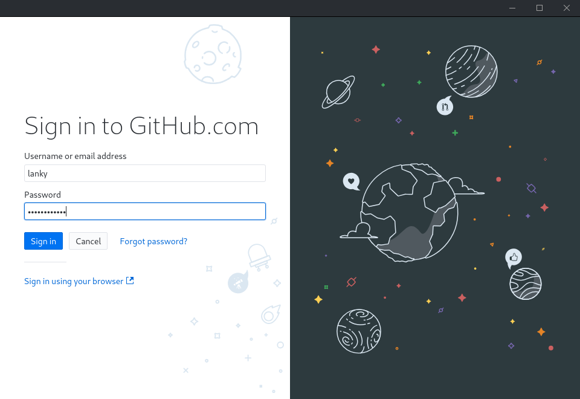
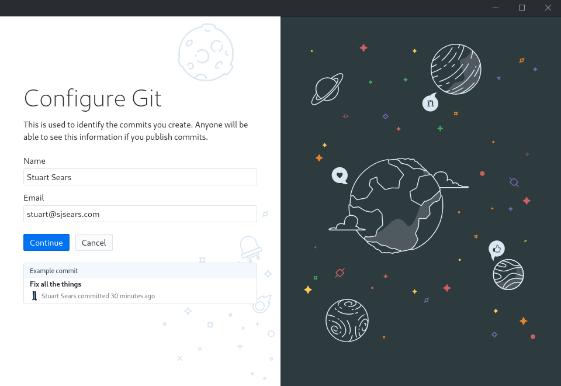
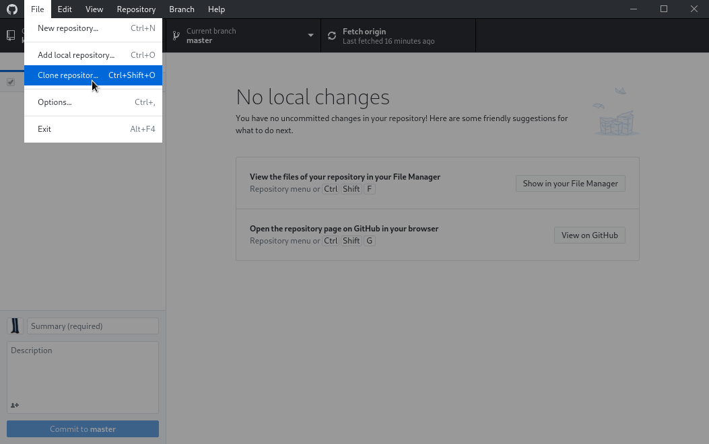
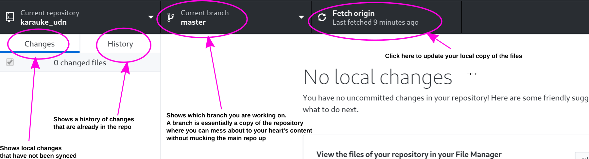
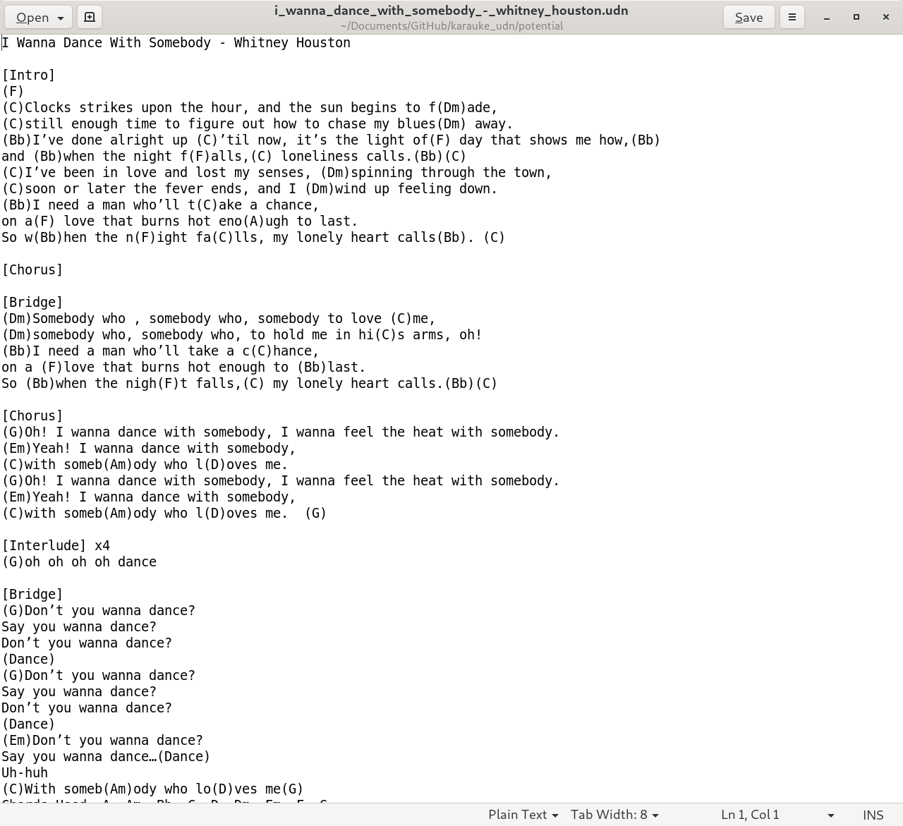
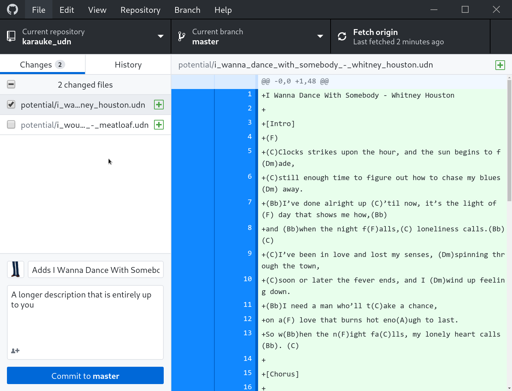
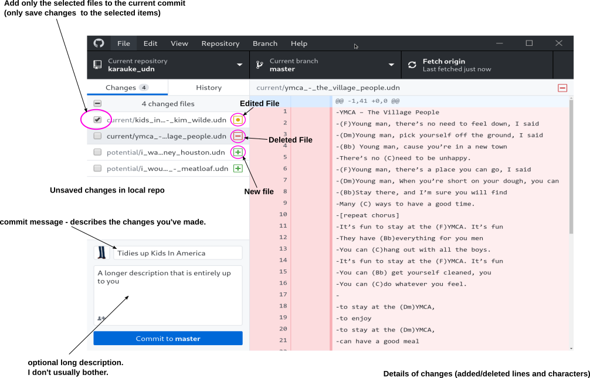
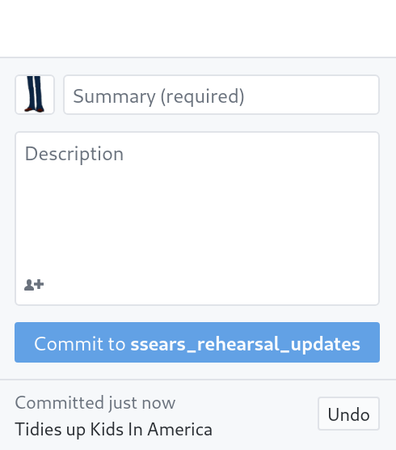

# Editing or Creating new songsheets
To create new, or edit existing sheets you'll need a basic understanding of how they're stored here. The songsheet repository is managed using a Version Control System called "Git". Yes, really.
While this is bound to be a little geeky, you really don't need to know the complicated underbelly, but rather follow a simple workflow.

## Git for muggles

Git allows us to track changes to files and directories and react to them when they happen. it supports tags and versioning and has the concept of multiple branches - effectively "versions" of the songsheet repo without having to store complete copies of everything mutiple times.

Git is designed to allow multiple people to work on the same repo at the same time and can automatically merge changes from multiple sources, as long as they don't directly contradict each other. If they do, it will complain and let you fix them.

# Basic workflow - the TL;DR part

## Before you start - clone or pull (update)

Get a local copy of the repo (more details below on how to do that). This is called 'cloning', as if you care.

If you already have a copy of the repo, update it to include the newest edits. This is called 'pulling'. Yes, I know.

## Working on things

You should generally work on your own copy (known as a branch) so that your work doesn't affect the current live book until you've completed it.
Eventually, new commits to the changes to the **master** branch will generate a new songbook automatically, although that's some way off.

So:

1. Create a new branch for your work, probably named after you. This is essentially a temporary copy of the songsheets so you can fuck them up as much as you like without breaking the book.

2. Do stuff to the files in the repo ON YOUR BRANCH.

3. Commit the changes you want to keep to the repo - this basically saves each change with a description and your ID so we know who did what and when)

4. Push those changes back to the server

5. Once you've done everything you want to, create  a PR (pull request) for the changes to be merged into the live book

6. Delete your branch once the changes are in.

You don't have to do no.6, but if you don't, you have to keep merging in other people's changes or very bad things happen. if you know how to do that, fine. But most of you won't.

While you can do all this using geeky commandline thingies, you don't need to.

# Git for muggles, via the GitHub Desktop App.
You don't need to know how to do the complicated bits above yourself (although if you want to know, I can show you the nerdy commands) - github (the site that stores these sheets) has an app to do this for you - [GitHub Desktop](https://desktop.github.com). So download and install it.

The Karauke book files are owned by an 'organisation' called karaukeband - I'll add you to it, you'll need to set your own username and password to get access.

You'll need a github account for this - I can invite you, so you end up in the karauke org and can change stuff.

## Download the github desktop app

Select the  appropriate download from [here](https://desktop.github.com) and install it

## Sign in
Open the app and choose **Sign in to GitHub.com** (not Github Enterprise or anything else)

## login with your GitHub account

## Configure git (how you want your name/email to appear in commit messages)

## Clone the songbook repository

Then in the window that pops up, fill the following into the Repository URL field:

`karaukeband/karauke_udn`

And put a destination directory into  the 'Local Path' field (if you don't want to use the default one)

Congratulations! You have a copy of the repository

# Actually doing something useful with the repo
When you start work, refresh the repo - you should see a **fetch origin** button in the top bar:

Before you make any changes you should always use this to pull any updates from the server.

## Create your own branch
Generally you should work on your own private copy of the files (they're all stored so are easy to merge)

* Click on the **current branch** button at the top and create a new branch with your name in it somewhere. You'll see everyone else's branches there too.

## Do Stuff
Use the **View the files of your repository in your File Manager** option (it's in the 'Repository' menu),
which will open Finder or Explorer or whatever you use at the right place

### Creating a new file
Use a TEXT EDITOR (something like notepad or notepadd++ or TextEdit, or vim, or Sublime Text, or whatever you prefer)
Just make sure that it saves in plain text without formatting, or Very Bad Things may happen.

Create a new file where you want it in the book structure - this will be 'current', or 'potential' probably.

This file should be in *ukedown* format, which is basically ukulele weds format without any bold or italics shenanigans - see [README.md](README.md) for more details

Save the file as PLAIN TEXT (have I pointed that out enough yet?) with a '.udn' extension. NOT '.udn.txt' or anything else. Windows users beware of hiding extensions :)

When you save this file, the github app should recognise that you've put something new into the repo (in this example I've added 2 potential songs, but only one is selected for committing)

Filename standard is all lowercase, title - artist, with underscores instead of spaces.

For example
`"I Wanna Eat Your Sprouts - Manky Christmas Band"` should be saved as `"i_wanna_eat_your_sprouts_-_manky_christmas_band.udn"

Index pages are generated from these files in lexical (alphabetical) order, naming matters.

### Editing an existing file

Guess what? Open and edit the file in a PLAIN TEXT EDITOR.

Save it.

It will appear in the list of changes for your branch.

### Inspecting changes to the repo before committing
Click on the "changes" tab in the app, you'll see a list of the uncommitted changes in your branch.

## Saving (Committing) Changes
On the 'Changes' screen, select the files you want to commit (generally you should do only one at a time, it makes tracking & undoing changes much simpler).
Also feel free to commit a file that's only partially edited (for example if you have done part of an update but need to stop for now).

You could do one commit per changed letter if you want, but that might be a bit obsessive.

On the bottom left of the 'Changes' screen are 2 boxes and a commit button - you should put a short description of your change in the little box.
The larger one is optional. Generally, one-line commit messages are ok.

When you've described your update - hit the 'Commit to <BRANCHNAME>' (it'll be your personal branch):

## Pushing your changes
Once you have some changes committed, you can publish them to the central repo - there's a **Publish Branch** button on the top bar for this.

If you have already pushed some changed, this might say something different.

use the **History** tab for this in the main window:

