<!-- markdownlint-disable MD0##-->
<!-- vim: set tw=80 : -->
# Installing git on Windows

Because the installer asks a lot of questions, this is a quick picture-heavy run-through of the git
for windows installer, hopefully with some explanations

Download the installer from [here](https://git-scm.com/downloads) and run it, accepting the defaults
for each screen until you get to the following

## Choosing an editor

If you make changes to files controlled by git, you will normally need to write a commit message (a
brief explanation of what/why you are changing things). Git requires a text-mode editor and will
offer you a list of editors to choose from.

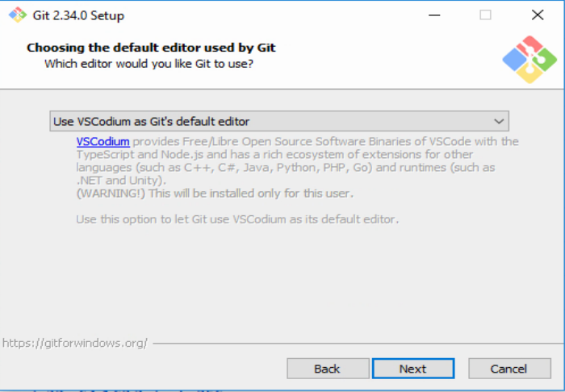

You will not want to use the default of 'Vim' because that is complicated and not particularly
user-friendly - I would choose one of
* `Notepad++`
* `VSCodium`
* `Atom`

The first of these is the simplest - it's just Notepad on steroids, the other two are programmer's
editors (or IDEs) which understand git natively. Or choose something completely
different.

## Selecting the default branch

You can accept the default setting here.

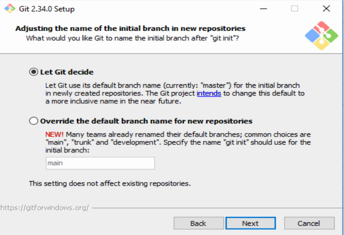

## Setting the PATH

This controls where you can run git commands from - the best choice is the second (recommended)
option which allows you to use it from the windows command prompt.

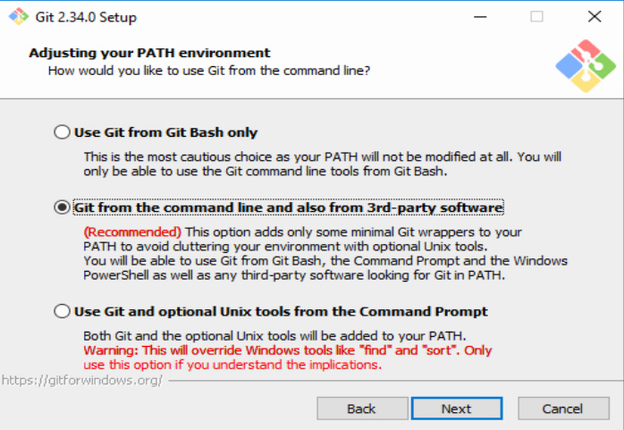

## Choosing SSH binaries

Accept the default, unless you know better

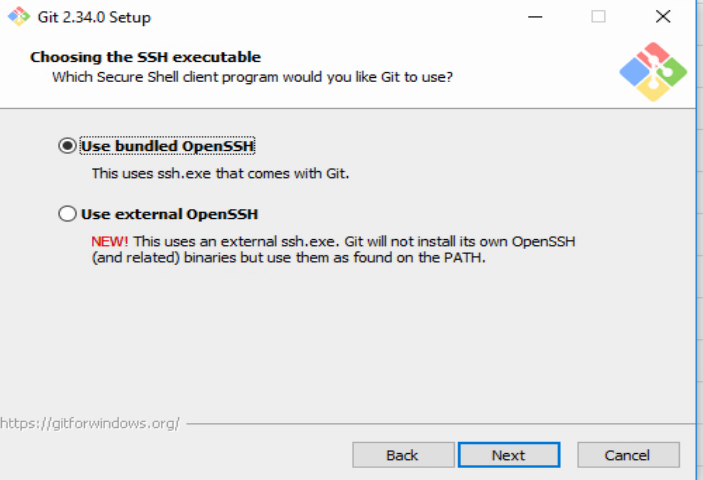

## Choosing openSSL libraries

Accept the defaults, unless you know better :)

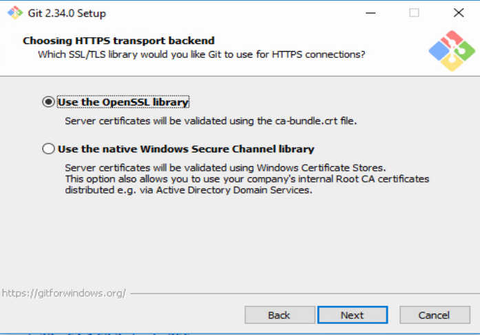

## Line Endings

Naturally, Mac, Windows and Linux/UNIX use different characters for line endings. To keep it
consistent, we choose the first option, as shown:

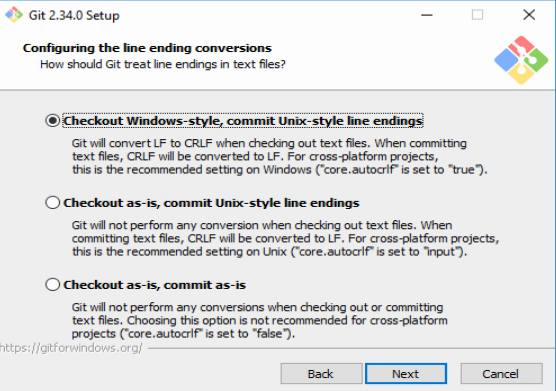

## Choose your default terminal

It's arguably best to just accept the default here

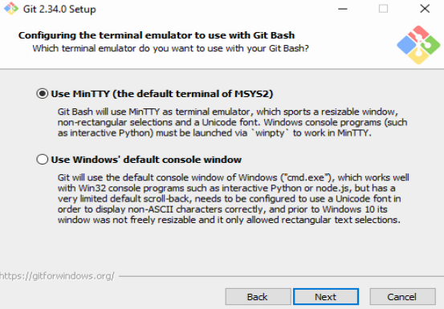

## Choose the update method

The next screen asks you what to do when you update a local copy (called `pulling`. Yes, seriously).
There are several options here, all of which have drawbacks. My preferred version is the second, so
choose that :)

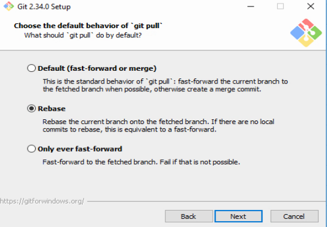

## Credential Helpers

Just accept defaults

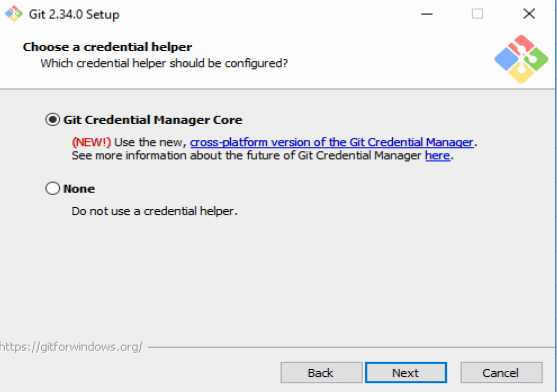

## Symlink settings

Symlinks are roughly what windows refers to as "shortcuts". Normally these are not stored in git,
but they are useful, so enable that:

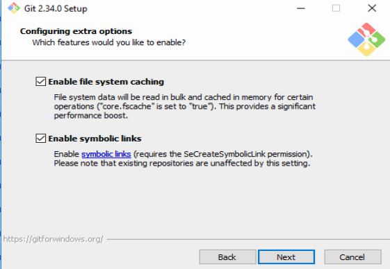

## Experimental Features

None of this malarkey, thanks. Unless you really know what you are doing

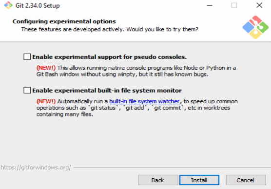

Now that should all be working, we can go back to the building docs :)
